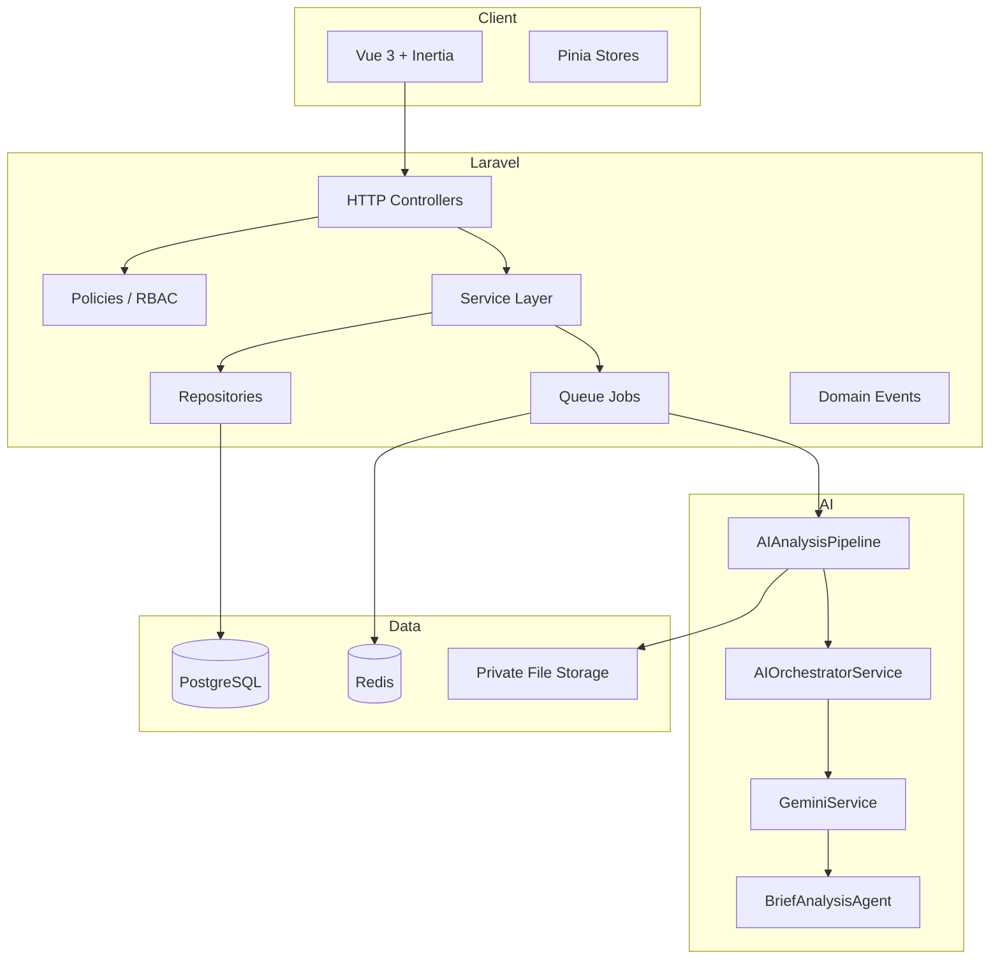
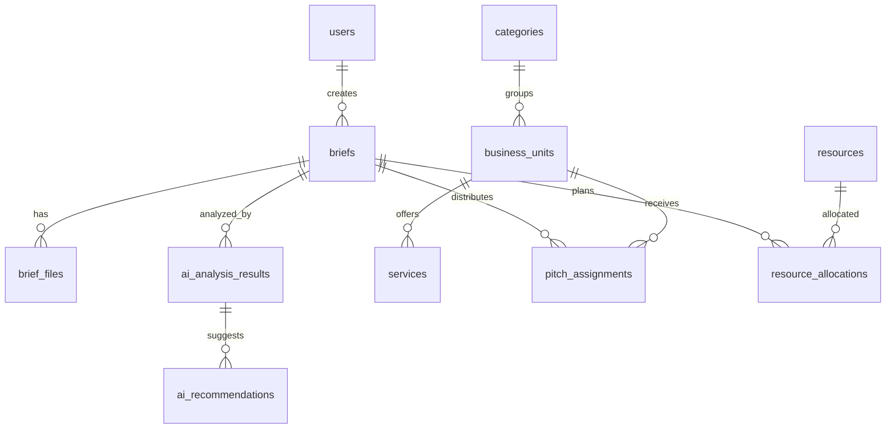

# BriefGood Platform Architecture

BriefGood is an enterprise AI platform for holding companies and agency groups. It centralizes client RFPs/briefs, analyzes them with Google Gemini via Laravel AI, standardizes output, recommends business units, estimates resources, and distributes pitch opportunities internally.

## High-Level Architecture



## Folder Structure

### Laravel (`app/`)

| Layer | Path | Responsibility |
|-------|------|----------------|
| Agents | `app/Agents/` | Laravel AI structured-output agents |
| Contracts | `app/Contracts/` | `AIProviderInterface` |
| DTOs | `app/DTOs/AI/` | Typed AI input/output |
| Enums | `app/Enums/` | Roles, brief status, pitch status |
| Events | `app/Events/` | Brief analysis lifecycle |
| Jobs | `app/Jobs/` | `AnalyzeBriefJob` on `ai-analysis` queue |
| Models | `app/Models/` | Eloquent domain models (UUID PKs) |
| Policies | `app/Policies/` | Authorization |
| Repositories | `app/Http/Repositories/` | Query abstraction |
| Services | `app/Services/AI/` | Orchestration, matching, prompts |

### Frontend (`resources/js/`)

| Path | Responsibility |
|------|----------------|
| `pages/` | Inertia pages (Dashboard, Briefs, BU CMS, Pitch Pipeline) |
| `components/ui/` | shadcn-style primitives (reka-ui) |
| `stores/` | Pinia state (brief filters) |
| `routes/` | Wayfinder-generated route helpers |

## Database Schema (PostgreSQL)

Core entities use **UUID primary keys** and **soft deletes** where noted.

- **RBAC**: `roles`, `permissions`, `permission_role`, `role_user`
- **CMS**: `categories`, `business_units`, `services`, `business_unit_service`, `prompt_templates`, `ai_settings`
- **Briefs**: `briefs`, `brief_files`
- **AI**: `ai_analysis_results`, `ai_recommendations`
- **Pitch**: `pitch_assignments`, `pitch_responses`
- **Resources**: `resources`, `resource_allocations`
- **Audit**: `activities`, `audit_logs`, `email_logs`, `notification_settings`

`users` retains bigint PK for Fortify compatibility; domain tables reference `users.id`.

## ERD (Conceptual)



## AI Orchestration Flow

1. Admin uploads PDF → `BriefController@store`
2. `AnalyzeBriefJob` dispatched to `ai-analysis` queue
3. `AIAnalysisPipeline` extracts PDF text (smalot/pdfparser), builds `BriefAnalysisInputDto`
4. `PromptBuilderService` sanitizes input and injects BU catalog
5. `AIOrchestratorService` calls `GeminiService` (Flash default; Pro if complexity ≥ threshold)
6. `BriefAnalysisAgent` returns structured JSON schema
7. Results persisted; `BusinessMatchingService` syncs recommendations + keyword enrichment
8. Resource allocations and pitch assignments created
9. `BriefAnalysisCompleted` event fired

## Queue Architecture

| Queue | Workers | Purpose |
|-------|---------|---------|
| `default` | Supervisor | General jobs |
| `ai-analysis` | Dedicated workers | PDF + Gemini analysis (isolated, retriable) |

Redis backs queues and cache in production. Failed jobs land in `failed_jobs`.

## Security Architecture

- **Auth**: Laravel Fortify (2FA, passkeys)
- **RBAC**: `UserRole` enum + policies per resource
- **Uploads**: PDF-only, size limits, private disk, MIME validation
- **AI**: Prompt injection mitigation (sanitization, system instructions), structured JSON validation via agent schema
- **HTTP**: CSRF (Fortify/Inertia), rate limiting on auth routes, security headers in Nginx
- **Audit**: `activities`, `audit_logs` for traceability

## API Architecture

Primary interface is **Inertia** (server-driven SPA). Future REST/JSON API can version under `/api/v1` using existing API Resources (`BriefResource`, `AiAnalysisResource`).

## CMS Architecture

Editable modules via standard CRUD:

- Business Units + Services (seeded with 7 BUs from spec)
- Prompt Templates (DB-driven prompts)
- AI Settings (`ai_settings` key/value JSONB)
- Users & Roles (Fortify + `role` on users)

## Resource Planning Logic

AI returns `recommended_resources` with hours, workload %, and duration. Pipeline maps slugs to `resources` table and creates `resource_allocations`. Pre-seeded roles: Designer, Developers, Photographer, etc.

## Business Matching Algorithm

1. **Primary**: Gemini structured `recommended_business_units` with confidence %
2. **Enrichment**: Keyword scan on scope/deliverables (tiktok, reels, influencer, etc.) against `services.keywords`
3. **Pitch distribution**: Top recommendations → `pitch_assignments` per BU

## Deployment

### Docker (`docker-compose.yml`)

- `app`: Nginx + PHP-FPM + Supervisor
- `queue`: `queue:work redis --queue=default,ai-analysis`
- `postgres`: PostgreSQL 16
- `redis`: Redis 7

### CI/CD Recommendation

- GitHub Actions: Pint, Pest, `npm run build`, optional Docker build/push
- Stages: test → build assets → deploy to Laravel Cloud / K8s
- Secrets: `GEMINI_API_KEY` via encrypted env

### Scalable Infrastructure

- Horizontal queue workers for `ai-analysis`
- Read replicas for PostgreSQL analytics
- CDN for static assets; private S3 for brief PDFs
- Gemini rate-limit handling via job backoff

## Environment Variables

```env
GEMINI_API_KEY=
AI_DEFAULT_PROVIDER=gemini
BRIEFGOOD_AI_MODEL=gemini-2.0-flash
BRIEFGOOD_AI_ADVANCED_MODEL=gemini-2.5-pro
DB_CONNECTION=pgsql
QUEUE_CONNECTION=redis
CACHE_STORE=redis
```

## Default Credentials (local seed)

- Email: `admin@briefgood.test`
- Password: `password`
